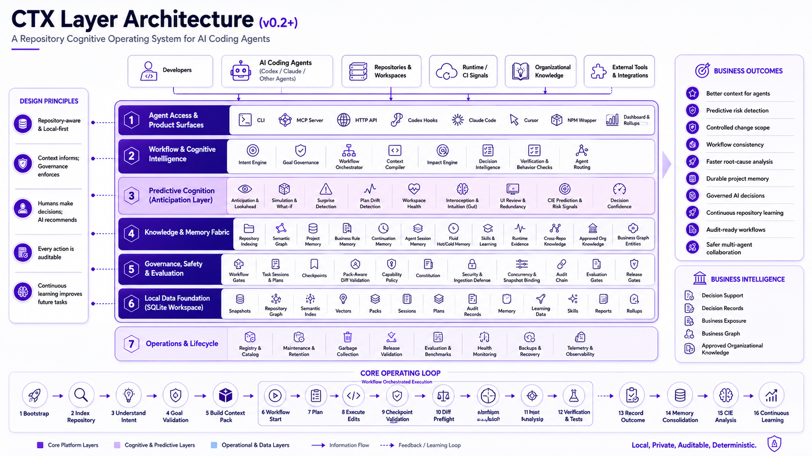

# CTX Layer

[](https://github.com/abhilashsblai/ctxlayer-release/releases/tag/v0.2.0a8)
[](#requirements)
[](LICENSE)
[](#mcp-integration)
[](#daily-agent-workflow)
[](#safety-notes)

CTX Layer is a Repository Cognitive Operating System for AI coding agents.

It gives Codex, Claude Code, Cursor, Gemini CLI, MCP clients, and other
software engineering agents long-term repository memory, workflow
orchestration, deterministic governance, impact analysis, predictive cognition,
and continuous learning.

Copyright (c) 2026 Abhilash Pillai. All rights reserved.

Developed by Abhilash Pillai.

## Why CTX Layer Exists

AI coding agents are powerful, but the raw workflow is still mostly stateless.
Agents can read files and write patches, yet they do not automatically remember
project decisions, understand approved business rules, know which tests protect
a behavior, detect scope drift, or learn from previous tasks.

CTX Layer gives the repository cognition. It sits beside your codebase, builds a
local-first model of repository context, and turns an ad hoc agent session into
a governed engineering loop:

> Before an agent edits this repository, what does it need to know, what must it
> avoid, what changed, what should be tested, and what should be remembered?



## Install In Minutes

Install or upgrade from the current release wheel:

```powershell
python -m pip install --upgrade "https://github.com/abhilashsblai/ctxlayer-release/releases/download/v0.2.0a8/ctxlayer-0.2.0a8-py3-none-any.whl"
ctxlayer --version
ctxlayer --repo . setup --agents codex,claude,cursor --install-hooks --configure-mcp --absolute-mcp-repo
ctxlayer --repo . workflow start --task "make a focused change" --path src/app.py
ctxlayer --repo . workflow next --task-session-id <task_session_id>
```

## Without CTX Layer Vs With CTX Layer

| Raw AI coding agent workflow | With CTX Layer |
| --- | --- |
| Reads whatever files it happens to find | Deterministic Context Packs |
| Forgets prior decisions and gotchas | Durable Repository Memory |
| Starts from a prompt, not a workflow | AI Agent Workflow Engine |
| Changes can drift outside intended scope | Pack-aware Diff Validation |
| Test choice is mostly manual or guessed | Impact Engine and linked tests |
| Business rules live in scattered docs | Project Rule Extraction and approval |
| Risk is discovered late in review | Predictive Cognition and surprise signals |
| Governance is inconsistent across agents | Capability Policies and checkpoints |
| Outcomes disappear after the chat ends | Audited task sessions and outcome memory |
| Repeated mistakes stay repeated | Cognitive Improvement Engine |

## Who This Is For

- Codex users who want repository memory and a repeatable local task loop.
- Claude Code, Cursor, Gemini CLI, and MCP users who need shared repository
  context across tools.
- AI engineering teams building agentic software engineering workflows.
- Enterprise software teams that need auditability, policy checks, and
  deterministic governance around AI-assisted changes.
- Open source maintainers who want coding agents to respect project rules,
  intended scope, and test impact.

## Problems CTX Layer Solves

- Agent forgets project decisions.
- Agent reads hundreds of irrelevant files.
- Agent misses business rules hidden in tests, docs, constants, PRs, or
  incidents.
- Agent changes files outside the intended scope.
- Agent does not know which tests protect a behavior.
- Agent cannot explain why a pack, plan, checkpoint, or outcome happened.
- Agent has no durable memory after the session ends.
- Agent repeats mistakes because outcomes are not converted into future context.

## Quick Tour

1. Bootstrap the repository with agent instructions, MCP config, and local
   policy files.
2. Index the codebase into snapshots, symbols, chunks, imports, tests,
   ownership signals, and local vectors.
3. Build a task-specific Context Pack for Codex, Claude Code, Cursor, or
   another MCP-compatible coding agent.
4. Create a structured plan with intended files, capabilities, risk, and tests.
5. Execute edits while CTX Layer records checkpoints against the active plan.
6. Run pack-aware diff validation and impact analysis before declaring success.
7. Run the recommended tests where practical.
8. Record the outcome so future agents can recall the decision, gotcha, or
   failure lesson.
9. Let the Cognitive Improvement Engine analyze repeated patterns, cognitive
   debt, prediction quality, and learning decay.

## Works With

| Surface | Status |
| --- | --- |
| Codex | CLI, MCP config, hooks, AGENTS.md workflow, child-agent coordination |
| Claude Code | MCP setup and shared CTX workflow contract |
| Cursor | MCP setup and shared repository context |
| MCP | Local stdio server for agent tools |
| HTTP | Local API and dashboard data |
| SQLite | Workspace-scoped local-first storage |
| AGENTS.md | Repository workflow contract for coding agents |
| npm/npx | Local wrapper for Python engine commands |

## Core Capabilities

- **Repository memory:** Resume interrupted work, recall decisions, preserve
  conventions, and reuse verified lessons.
- **Context engineering:** Serve bounded, deterministic Context Packs instead of
  relying on prompt stuffing or random file search.
- **AI agent workflow engine:** Drive `workflow start` and `workflow next` from
  durable evidence rather than from agent memory.
- **Impact analysis:** Identify affected files, linked tests, critical paths,
  and pack-aware scope risk.
- **Goal validation and governance:** Check plans, capabilities, checkpoints,
  constitutions, hooks, and CI policy surfaces.
- **Project rule extraction:** Extract candidate business rules from code,
  tests, docs, incidents, PRs, and runtime evidence, then require approval
  before serving them as authoritative context.
- **Predictive cognition:** Surface surprise scoring, lookahead, consequence
  simulation, interoception, and cross-repo transfer as conservative advisory
  signals.
- **Continuous learning:** Convert task outcomes, failures, and repeated
  patterns into safer future repository behavior.

## Current Release

Latest wheel: `ctxlayer-0.2.0a8-py3-none-any.whl`

Release asset:
`https://github.com/abhilashsblai/ctxlayer-release/releases/download/v0.2.0a8/ctxlayer-0.2.0a8-py3-none-any.whl`

SHA256:
`a348d2147aca306ebdde40ad0734b2921dd219289ebdabc984e0baf2fc39cec6`

Wheel size: `573658` bytes

The `0.2.0a8` build is a preview release for development and non-critical
repositories. Existing users should back up `.ctxlayer/workspace.db` before the
first run after upgrading.

The current wheel was built on 2026-06-23 from Advanced-CTX-Layer source commit
`9c6d227`. It includes the workflow orchestrator, feature-catalog workbook
drift checks, CI workflow linting, CIE surface expansion, snapshot-aware
workflow resume, multi-agent adapter support, anticipation preview,
reliable-enforcement work, large-DB performance work, memory optimization,
deep-GC maintenance, skill evolution, and write-time semantic guardrails.

### Why Upgrade From Earlier Wheels

Earlier preview wheels did not include the workflow orchestrator and could not
separate read-only work from write tasks through a durable task router.
`0.2.0a8` adds mode-aware classification, gate tracking, CLI/MCP workflow
surfaces, and CI-visible feature catalog drift checks.

Earlier preview wheels also carried the old large-database startup path. On the
real CTX Layer workspace DB, service construction was previously measured
around `6,890 ms` to `7,000 ms`. Accessing the large database also made recall
feel like a cold-start bottleneck: before the final `0.2.0a2` hot-path fix,
large-DB memory recall/access was measured around `273 ms` to `314 ms` because
recall resolved a full repository snapshot before scoring memory.

`0.2.0a8` packages the workflow, multi-agent, anticipation, performance,
reliable-enforcement, memory optimization, skill-evolution, CIE, and write-time
semantic guardrail fixes:

- The workflow orchestrator recommends task types, starts governed workflow
  sessions, evaluates pending gates, and returns the next required action.
- Workflow task types compose shared playbook fragments, including a
  `core_session` base and specialized write modes such as standard edit, test
  edit, CI edit, dependency edit, migration edit, security edit, and release
  work.
- Read-only and write modes are separated. Read tasks avoid write gates, while
  write tasks receive diff, plan, impact, test, and clean-worktree gates as
  appropriate.
- Volatile gates are fingerprinted, so checks such as clean-diff state become
  stale when the relevant changed paths change.
- Workflow snapshots are persisted in agent session memory and reused by
  `workflow next`, including newest-snapshot selection for restarted sessions.
- The workflow feature catalog exports a deterministic `features/features.xlsx`
  workbook. CI can run `python -m ctxlayer.workflow.export_features --check`
  to catch catalog or playbook drift.
- `ctxlayer workflow lint` validates the feature catalog, playbook, classifier,
  router, gates, and parameter contracts without requiring pytest.
- Codex advisory wiring can surface `workflow_next_action` through the pre-tool
  gate so agents see the missing workflow step before editing.
- The anticipation layer adds deterministic surprise scoring, calibrated
  prediction records, expected-free-energy lookahead, interoceptive gut state,
  and quarantined online learning.
- Codex PreToolUse hooks compute anticipation live through the service path,
  emit nudge events, and can only block high surprise when it is corroborated by
  an independent risk signal.
- Enforce mode is guarded by the latest model calibration ECE threshold and
  downgrades to warn mode until calibration is acceptable.
- Multi-agent setup is adapter-driven. `ctxlayer setup --agents
  codex,claude,cursor` renders native Codex, Claude Code, and Cursor surfaces
  from the same CTX Layer contract.
- `ctxlayer setup auto` detects the running supported agent and renders that
  agent's instruction file, MCP snippets, hooks, subagents, and skills where the
  agent supports them.
- Claude Code setup writes `CLAUDE.md`, `.claude/settings.json`,
  `.claude/agents/*.md`, `.claude/skills/ctx-loop/SKILL.md`, `.mcp.json`, and
  Claude hook registration that reuses the CTX Layer hook.
- Cursor setup writes `.cursor/rules/ctxlayer.mdc` and `.cursor/mcp.json`, and
  reports `mcp-only` enforcement because Cursor does not provide lifecycle
  hook, subagent, or skill surfaces.
- Steady-state `CtxLayerService` construction is measured in the low
  single-digit millisecond range after the migration and large-DB fixes.
- Memory recall/access against large DBs is measured in the low tens of
  milliseconds in release-gate runs; DB-size warnings are still surfaced through
  `ctx_health`.
- Existing DBs with populated `schema_migrations` but `PRAGMA user_version = 0`
  use the count-based migration gate, avoiding unnecessary reconciliation
  before the later `user_version` cleanup.
- Reliability work adds bounded query budgets, persisted health probes,
  fail-loud degraded pack/enforcement status, governed verification artifacts,
  and deep garbage collection for old snapshot content.
- Deep GC works on production-sized CTX databases with sqlite-vec enabled:
  vector row cleanup is batched below SQLite host-parameter limits, so pruning
  large snapshot generations no longer crashes with `too many SQL variables`.
- Snapshot retention unpins aged reconstructible context packs before deep
  pruning. This lets old index generations become collectible while preserving
  `bound_snapshot_id` and manifest history for audit/reconstruction.
- Write-time semantic guardrails flow from governed `memory_enforcement`
  directives into context packs and plans, the Codex PreToolUse gate,
  `check-diff`/CI validation, audited override handling, and dashboard/rollup
  telemetry. Guardrails default to warn mode and can be raised to content-match
  blocking with approval, severity, and confidence floors.
- Large database compaction is explicit and safer. Databases above the compact
  threshold use `VACUUM INTO` to create a verified `.compact` sidecar, report
  `compact_swap_required`, and tell the operator which compact copy must
  replace the live database after CTX processes are stopped.

## Execution Workflow

CTX Layer gives an AI coding agent a structured operating loop:

- Classify the requested task and recommend the right workflow.
- Start or resume a workflow session with durable task metadata.
- Build a deterministic context pack for the task.
- Create a structured plan with files, tests, capabilities, and risk.
- Validate changed files against the active plan step.
- Analyze impact and likely tests for changed paths.
- Check the final diff against the context the agent received.
- Record a durable outcome summary for future tasks.
- Capture project intelligence, decisions, business rules, runtime signals, and
  learned improvement signals.

The core workflow is local-first. Repository state, project intelligence
records, packs, audit entries, dashboard data, workflow snapshots, and CIE
learning runs live in the project workspace unless you explicitly export or
integrate them elsewhere.

## Built For Governed Agent Coding

Coding agents can edit quickly, but they can also miss context, over-edit,
forget project rules, repeat old mistakes, or leave no useful trail for the next
developer or agent. CTX Layer addresses those gaps by making context,
governance, verification, project intelligence, workflow state, and improvement
first-class parts of the coding loop.

It is designed around one practical question:

Before an agent edits this repository, what does it need to know, what must it
avoid, and how should the result be verified?

## Key Capabilities

- **Workflow orchestrator**: recommends task types, starts sessions, records
  workflow snapshots, evaluates durable and volatile gates, and reports the
  next required action.
- **Feature catalog and playbook**: defines workflow task types, required
  capabilities, gates, parameters, escalation behavior, and deterministic
  workbook export.
- **Context packs**: task-specific snapshots of relevant files, memory, policy,
  impact signals, business rules, runtime evidence, and provenance.
- **Task sessions**: traceable task start, pack serving, plan creation,
  checkpoints, verification, workflow gate recording, and outcome recording.
- **Structured plans**: JSON-backed plans with objective, steps, intended
  files, intended tests, capabilities, and risk levels.
- **Plan checkpoints**: verifies that edited files belong to the active plan
  step or require an explicit plan amendment.
- **Diff checks**: compares the final diff and changed paths against the served
  context pack and impact closure.
- **Impact reports**: identifies impacted files, linked tests, risk signals,
  critical paths, and review focus.
- **Capability policy**: warns or blocks risky work such as secrets,
  dependency changes, migrations, generated files, CI changes, and critical
  paths.
- **Audit chain**: records task events and outcomes with tamper-evident hashes
  for accidental edits and partial tampering.
- **Project intelligence**: stores outcomes, conventions, gotchas, decisions,
  runtime signals, business rules, and approved project knowledge.
- **MCP support**: exposes CTX Layer tools to MCP-compatible agents and
  clients, including workflow and CIE surfaces.
- **Dashboard and rollups**: renders project, memory, learning, security, CIE,
  workflow, and release-health views.

## Workflow Orchestrator

The workflow orchestrator is the main new capability in `0.2.0a8`. It gives
agents a task-specific route before they begin editing.

Workflow capabilities include:

- `ctxlayer workflow recommend` for task classification and route preview.
- `ctxlayer workflow start` for creating a governed workflow snapshot.
- `ctxlayer workflow next` for checking pending gates and the next action.
- `ctxlayer workflow lint` for validating catalog/playbook/router consistency.
- MCP tools for recommendation, start, and next-action surfaces.
- Mode-aware classification for read-only, write, test, CI, dependency,
  migration, security, release, documentation, and troubleshooting work.
- Durable gates for pack, plan, checkpoint, impact, diff, tests, outcome, and
  release-specific checks.
- Volatile gates for state that can change under the agent, such as clean diff
  checks that depend on changed-path fingerprints.
- Snapshot recovery through agent session memory if a task session is resumed.
- Feature-catalog workbook export for human inspection and CI drift checks.

Useful commands:

```powershell
ctxlayer --repo . workflow recommend --task "fix checkout validation"
ctxlayer --repo . workflow start --task "fix checkout validation" --mode write
ctxlayer --repo . workflow next --task-session-id <task_session_id>
ctxlayer --repo . workflow lint
python -m ctxlayer.workflow.export_features --check
```

## Cognitive Improvement Engine

The Cognitive Improvement Engine, or CIE, tracks recurring mistakes and weak
signals, classifies likely root causes, predicts recurrence risk, proposes
checklists and interventions, and records whether improvements are effective
over time.

CIE functionality is enabled by default in the current wheel. Guardrails still
apply: local config overrides, learning-off switches, approval metadata,
required gates, and rollback capability can block adoption.

CIE includes:

- Mistake and near-miss classification.
- Root-cause and meta-root-cause tracking.
- Hypothesis generation and validation.
- Recurrence prediction for risky task patterns.
- Checklist preview and checklist injection support.
- Cognitive-debt scoring.
- Rule effectiveness and decay tracking.
- Improvement score and learning-quality metrics.
- Counterfactual and decision-quality signals.
- Opportunity-cost tracking.
- Controlled adoption, rejection, suspension, and rollback actions.
- CLI, HTTP, MCP, dashboard, and rollup surfaces.

Useful CIE commands:

```powershell
ctxlayer --repo . cie status
ctxlayer --repo . cie predict --task "describe the task" --path src/app.py
ctxlayer --repo . cie checklist-preview --task "describe the task"
ctxlayer --repo . cie cycle --task "review recent work" --limit 20
ctxlayer --repo . cie archive --limit 10
ctxlayer --repo . cie show <run_id>
ctxlayer --repo . cie score
ctxlayer --repo . cie timeline --run-id <run_id>
ctxlayer --repo . cie preview-adoption <intervention_id> --run-id <run_id>
ctxlayer --repo . cie adopt <intervention_id> --run-id <run_id> --approved-by <name>
ctxlayer --repo . cie reject <intervention_id> --run-id <run_id> --reason "not useful"
ctxlayer --repo . cie rollback <intervention_id> --run-id <run_id> --approved-by <name>
```

## More Feature Areas

- **Intent discovery**: creates intent-backed context packs and task framing.
- **Goal governance**: supports goal records, advisory challenges, accepted
  alternatives, and decision traceability.
- **Learning loop**: runs optimization previews, benchmark trends, bounded
  adoption, revert flows, and loop-closure verification.
- **Self-modification controls**: proposes, archives, adopts, and reverts
  controlled self-modification candidates.
- **Decision support**: records questions, options, evidence, unknowns,
  analysis, selected option, rationale, and decision history.
- **Business memory**: extracts and approves business entities, links, rules,
  conflicts, stale records, and impact exposure.
- **Organizational intelligence**: ingests local or exported organization
  sources through redaction, quarantine, approval, and audit flows.
- **Semantic indexing**: indexes semantic findings, graph context, repository
  search, confidence repair, low-confidence findings, and accuracy evaluation.
- **Security gates**: scans secrets and risky text, audits redaction, manages
  quarantine, and ingests red-team fixture results.
- **Runtime evidence**: stores incidents, CI failures, feature flags, and
  operational signals as context and learning candidates.
- **Workspace support**: indexes multiple repositories and records cross-repo
  contracts, edges, packages, schemas, and generated-client relationships.
- **Release and CI support**: emits local CI checks, release validation, audit
  anchors, annotations, workflow linting, feature-workbook drift checks, and
  release-gate artifacts.
- **Project registry**: tracks projects where CTX Layer has been installed or
  updated.
- **Memory optimization and maintenance**: reports database size, retention
  state, maintenance history, dry-run GC forecasts, deep snapshot pruning,
  packed vectors, FTS cleanup, edge pruning, aged pack unpinning, and safe
  compact-copy workflows for large workspaces.

## Requirements

- Python 3.11 or newer
- Git
- A terminal with access to the project repository

Optional:

- Codex or another coding agent that reads `AGENTS.md`
- Claude Code, Cursor, or another MCP-compatible client for tool integration
- A virtual environment, `pipx`, or another isolated Python environment

## Install

Install or upgrade directly from the release wheel:

```powershell
python -m pip install --upgrade "https://github.com/abhilashsblai/ctxlayer-release/releases/download/v0.2.0a8/ctxlayer-0.2.0a8-py3-none-any.whl"
```

Verify:

```powershell
ctxlayer --version
```

Expected output:

```text
ctxlayer 0.2.0a8
```

Avoid creating a new `.venv` inside the target project before setup unless you
plan to exclude it from indexing. A virtual environment outside the project is
usually cleaner.

## Configure A Project

Run setup from the root of the repository where you want to use CTX Layer.

For a new folder that is not already a Git repository:

```powershell
ctxlayer --repo . setup --agents codex,claude,cursor --init-git --install-hooks --configure-mcp --absolute-mcp-repo
ctxlayer --repo . doctor
ctxlayer --repo . workflow recommend --task "initial setup smoke test"
```

For an existing Git repository, omit `--init-git`:

```powershell
ctxlayer --repo . setup --agents codex,claude,cursor --install-hooks --configure-mcp --absolute-mcp-repo
ctxlayer --repo . doctor
ctxlayer --repo . plan --help
ctxlayer --repo . workflow lint
```

Setup may create or update:

- `AGENTS.md`
- `CLAUDE.md`
- `.cursor/rules/ctxlayer.mdc`
- `ctxlayer.capabilities.yaml`
- `.ctxlayer/`
- `.claude/`
- `.cursor/mcp.json`
- `.mcp.json`
- local Git hooks, when `--install-hooks` is used
- MCP snippets under `.ctxlayer/mcp/`

Usually commit:

- `AGENTS.md`
- `CLAUDE.md`, if Claude Code setup is used
- `.cursor/rules/ctxlayer.mdc`, if Cursor setup is used
- `ctxlayer.capabilities.yaml`

Usually do not commit:

- `.ctxlayer/`
- machine-specific MCP snippets or local database files

`.ctxlayer/` contains local workspace state, databases, generated context, and
machine-specific MCP snippets.

## Daily Agent Workflow

After setup, the generated `AGENTS.md` asks agents to use this lifecycle. The
new workflow-oriented path is:

```powershell
ctxlayer --repo . workflow recommend --task "<task>"
ctxlayer --repo . workflow start --task "<task>"
ctxlayer --repo . workflow next --task-session-id <task_session_id>
```

The legacy-compatible lower-level path is still available and remains useful
for manual scripts:

```powershell
ctxlayer --repo . task start --task "<task>"
ctxlayer --repo . pack --task "<task>"
```

Create a structured task plan:

```powershell
ctxlayer --repo . plan create --task-session-id <task_session_id> --pack-id <pack_id> --file <plan.json>
```

Checkpoint changed files:

```powershell
ctxlayer --repo . plan checkpoint <plan_id> --step-id <step_id> --path <changed_path>
```

Run preflight checks before declaring work complete:

```powershell
git diff HEAD | ctxlayer --repo . check-diff --pack-id <pack_id>
git diff --name-only HEAD | ctxlayer --repo . check-diff --pack-id <pack_id> --paths-from-stdin
git diff --name-only HEAD | ctxlayer --repo . impact --paths-from-stdin
```

Record the outcome:

```powershell
ctxlayer --repo . outcome --pack-id <pack_id> --result pass --summary "<what changed and why>"
```

The outcome summary is important. It becomes durable project memory that future
tasks can retrieve.

## Common Commands

Workflow:

```powershell
ctxlayer --repo . workflow recommend --task "describe the change"
ctxlayer --repo . workflow start --task "describe the change" --mode write
ctxlayer --repo . workflow next --task-session-id <task_session_id>
ctxlayer --repo . workflow lint
python -m ctxlayer.workflow.export_features --check
```

Project health:

```powershell
ctxlayer --repo . doctor
ctxlayer --repo . index
ctxlayer --repo . gc
ctxlayer --repo . db-stats
ctxlayer --repo . gc --deep --dry-run
ctxlayer --repo . gc --deep
ctxlayer --repo . maintenance history
```

Context, impact, and search:

```powershell
ctxlayer --repo . pack --task "describe the change"
ctxlayer --repo . impact --paths src/app/service.py
git diff --name-only HEAD | ctxlayer --repo . check-diff --pack-id <pack_id> --paths-from-stdin
ctxlayer --repo . search "business rule"
```

Memory and business knowledge:

```powershell
ctxlayer --repo . memory candidates
ctxlayer --repo . memory list
ctxlayer --repo . business entity list
ctxlayer --repo . business link list
```

Learning and CIE:

```powershell
ctxlayer --repo . learning status
ctxlayer --repo . learning loop-verify --all
ctxlayer --repo . cie status
ctxlayer --repo . cie cycle --task "review recent work"
ctxlayer --repo . cie score
```

Decision support:

```powershell
ctxlayer --repo . decision start --question "Which approach should we use?" --option "A" --option "B"
ctxlayer --repo . decision analyze <decision_id>
ctxlayer --repo . decision record <decision_id> --chosen <option_id> --rationale "why"
```

Security, semantic, and org knowledge:

```powershell
ctxlayer --repo . security scan
ctxlayer --repo . semantic index
ctxlayer --repo . semantic search "checkout flow"
ctxlayer --repo . org ingest --source local --path docs
```

Dashboard, rollup, and MCP:

```powershell
ctxlayer --repo . dashboard render --output .ctxlayer/dashboard.html
ctxlayer --repo . rollup --output .ctxlayer/rollup.json
ctxlayer --repo . mcp
```

HTTP server:

```powershell
ctxlayer --repo . serve --host 127.0.0.1 --port 8765 --auth token
```

## MCP Integration

Setup can generate MCP snippets for supported clients:

```powershell
ctxlayer --repo . setup --agents codex,claude,cursor --configure-mcp --absolute-mcp-repo
```

The MCP server exposes the same local project intelligence used by the CLI:
context packs, impact, memory, learning, workflow routing, CIE, decision
support, dashboard data, and governance flows.

For local use:

```powershell
ctxlayer --repo . mcp
```

Review generated `.ctxlayer/mcp/` files before copying them into a client
configuration.

## CI And Release Notes

Recommended CI checks for source repositories using the current workflow system:

```powershell
ctxlayer --repo . ci check
ctxlayer --repo . workflow lint
python -m ctxlayer.workflow.export_features --check
```

`workflow lint` catches broken catalog/playbook/router contracts. The workbook
check catches uncommitted drift between the source catalog and
`features/features.xlsx`.

For package maintainers, build from a clean committed source tree and publish a
new wheel version for every source change that reaches the release repository.
The release README should record the wheel name, SHA256, size, release URL,
build date, and source commit.

## Upcoming Enhancements

The next planned areas build on the current workflow, memory, reliability, and
learning foundation:

- **Workflow policy packs**: make workflow catalogs easier to tune for teams,
  repositories, and regulated change types.
- **Organizational agent skill enhancement**: promote proven project-level
  agent skills into organization-level skill libraries, validate them across
  repositories, track ownership and approval, and route the right skill
  guidance into context packs for each team or codebase.
- **Cross-project memory governance**: improve privacy checks, redaction,
  approval workflows, and revalidation before a local lesson or skill becomes
  reusable organization knowledge.
- **Cold memory tiering**: summarize or archive old, low-access memories and
  index generations while keeping current recall fast and bounded.
- **Automated compact swap support**: add a guarded command to perform the
  verified `.compact` database swap when no CTX process is holding the live DB.
- **Retention policy controls**: expose more per-repo and per-target retention
  policy options through CLI, MCP, dashboard, and release-health views.
- **Large-workspace diagnostics**: add clearer dashboards for table growth,
  pinned snapshots, context-pack aging, vector storage, and reclaim estimates.
- **Enterprise rollout controls**: strengthen multi-repo policy packs,
  release gates, team dashboards, and audit exports for managed deployments.

## Updating Existing Workspaces

Back up the workspace database before first use of this preview on an important
repository:

```powershell
Copy-Item .ctxlayer\workspace.db .ctxlayer\workspace.db.pre-0.2.0a8.bak
```

Install the current wheel:

```powershell
python -m pip install --upgrade "https://github.com/abhilashsblai/ctxlayer-release/releases/download/v0.2.0a8/ctxlayer-0.2.0a8-py3-none-any.whl"
```

Then verify:

```powershell
ctxlayer --version
ctxlayer --repo . doctor
ctxlayer --repo . index
ctxlayer --repo . workflow recommend --task "release update smoke test"
ctxlayer --repo . workflow lint
ctxlayer --repo . pack --task "release update smoke test"
ctxlayer --repo . cie status
ctxlayer --repo . db-stats
ctxlayer --repo . gc --deep --dry-run
```

If `ctxlayer --repo . gc --deep` reports `compact_swap_required: true`, CTX has
created and verified a compact database copy, usually named
`.ctxlayer/workspace.db.compact`. Stop CTX processes, back up the live
`.ctxlayer/workspace.db`, then replace it with the compact copy. This manual
swap avoids Windows open-file lock issues and makes the reclaim step explicit.

For large existing workspaces, the recommended first maintenance pass is:

```powershell
ctxlayer --repo . db-stats
ctxlayer --repo . gc --deep --dry-run
ctxlayer --repo . gc --deep
ctxlayer --repo . db-stats
```

The dry run shows the expected snapshot, edge, vector, FTS, policy, and aged
context-pack unpinning counts before anything is deleted.

## Safety Notes

- CTX Layer is local-first, but generated configuration and hooks should still
  be reviewed before team-wide adoption.
- Context packs, workflow gates, and memory are only as good as the repository
  state and approvals they are built from.
- CIE adoption is enabled by default in this release, but guarded by local
  configuration, approval metadata, learning-off switches, gates, and rollback
  support.
- Workflow recommendations are governance aids. They do not replace human
  judgment for high-risk migrations, security changes, regulated production
  work, or enterprise rollout decisions.
- The audit chain is tamper-evident for accidental edits and partial tampering.
  It is not a substitute for access control on the local workspace database.
- This preview should be exercised on development repositories before use on
  critical production codebases.

## Repository Layout

This release repository contains:

- `releases/`: wheel artifacts for direct installation.
- `docs/`: public documentation and preview assets.
- `README.md`: current release overview and install instructions.
- `LICENSE`: license terms.

The main development source is maintained separately in the Advanced CTX Layer
project. This repository is the public release distribution point.

## License

Copyright (c) 2026 Abhilash Pillai. All rights reserved.

CTX Layer is currently free to use for local, personal, non-commercial projects.
Commercial use, enterprise deployment, resale, redistribution as part of a paid
product or service, hosted service use, and internal company-wide rollout
require prior written permission and a separate commercial license from
Abhilash Pillai.

See [LICENSE](LICENSE) for the full terms.
